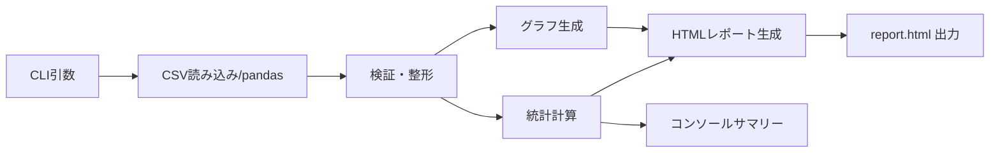

# 02. アーキテクチャ設計

## 全体像
単一の CLI コマンド（例: `python -m ...` / `analyze`）として実行し、入力 CSV から分析結果（統計 + 可視化）を生成して HTML レポートとして出力する。

## コンポーネント分割
1. **CLI 層**
   - `argparse` による引数受付（入力パス、出力パス、図の種類/テーマ等）
   - 実行ログ（標準出力）と終了コード制御
2. **IO/Validation 層**
   - pandas で CSV 読み込み
   - 必須カラム検証（`date`, `value`）、型変換、欠損・不正値の扱い
3. **Analysis 層**
   - 基本統計（平均/中央値/最小/最大）算出
   - 件数、期間（min/max date）などの付帯情報
4. **Visualization 層**
   - 時系列グラフ生成
   - 生成物は HTML レポートに埋め込める形式（画像 base64、または plotly の HTML 断片）
5. **Report 層**
   - HTML テンプレートに統計とグラフを流し込み、`report.html` を生成

## データフロー

## 例外・エラーハンドリング方針
- 入力ファイルが存在しない/読めない: 明示メッセージ + 終了コード 2
- 必須カラム欠如、日付パース失敗、数値変換失敗: 明示メッセージ + 終了コード 2
- 出力先に書けない: 明示メッセージ + 終了コード 1

## 技術選定（方針）
- CSV/集計: **pandas**
- 可視化: **matplotlib もしくは plotly**（後続 ADR で決定）
- HTML レポート:
  - シンプルに文字列組み立て、またはテンプレートエンジン（例: Jinja2）

## 想定ディレクトリ構成（実装フェーズの指針）
- `src/<package>/...` の src layout を採用
- `analyze.py` は CLI エントリポイント（モジュールとして配置し、console_scripts で公開も検討）

